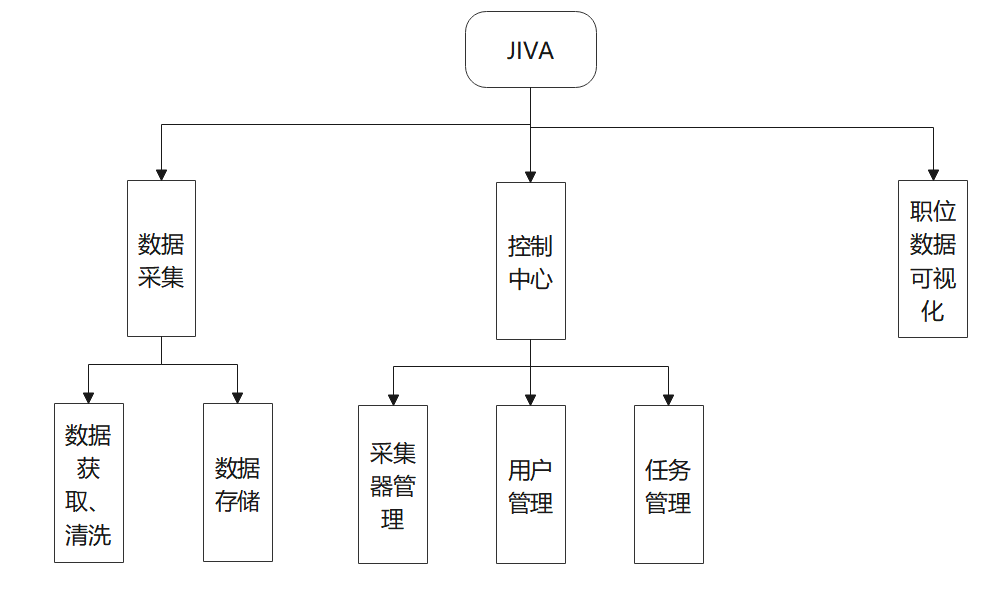

## Crawler

### 技术栈

语言: Typescript

前端: React + Antd + Echarts + Vite
后端: Nest
数据库: MongoDB
爬虫: Playwright
单元测试: Vitest

### 功能模块

系统功能模块图


### 项目结构

```

┌─ node_modules     //node依赖
├─ db
|  └─ init_db.js    //mongodb 初始化脚本
|
├─ dist             //项目输出文件夹
|  ├─ node_modules    //私有依赖, common包
|  ├─ back-end        //后端接口管理
|  ├─ crawler         //采集器进程
|  ├─ public          //前端资源
|  └─ package.json
|
├─ docs             //文档      
|  └─ ...
|
├─ packages
|  ├─ common        //共同依赖, 包括类型、库函数
|  ├─ crawlers
|  ├─ font-end
|  └─ back-end
|
├─ tsconfig.json            //全局ts配置
├─ vitest.config.mts        //vitest单元测试配置
├─ .gitignore
├─ package.json
├─ pnpm-lock.yaml
├─ pnpm-workspace.yaml
├─ README.md
└─ LICENSE
```

> 私有依赖: @asnc/tslib
> 开发依赖: typescript，@asnc/ts_hook. 这两个包未添加到项目中

### 后端配置

从环境变量注入配置

```
"DB_PWD": 数据库密码",
"DB_USER": 数据库用户名,
"DB_AUTH_DB": 认证数据库,
"LOGS_DIR": 日志目录, 相对于进程工作目录. 如果为空则关闭日志
"MODE": "prod"|"dev"    运行模式 prod 使用80端口, dev使用3000端口
```

vscode debugger 模板

```
{
    "type": "node",
    "request": "launch",
    "sourceMaps": true,
    "name": "后端调试",
    "env": {
        "DB_PWD": "数据库密码",
        "DB_USER": "数据库用户名",
        "DB_AUTH_DB": "认证密码",
        "LOGS_DIR": "logs"
        "MODE": "dev"    运行模式 prod 使用80端口, dev使用3000端口
    },
    "runtimeArgs": ["--loader", "/A:/packages/asnc-pack/ts_hook/hook.mjs"],
    "skipFiles": ["<node_internals>/**", "**/node_modules/**"],
    "program": "${workspaceFolder}/packages/back-end/src/main.ts",
    "cwd": "${workspaceFolder}"
}
```
